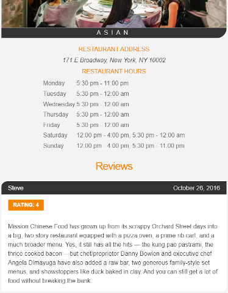

# Restaurant Reviews App - Stage 1
The main goal of the project is to advance students' skills in responsive design, service worker and accessibility areas while practicing on a static webpage and transforming it into a mobile-ready web application.
## About
This website offers a search for restaurants. The main page allows to specify the location and cuisine type.
Clicking on the **View Details** shows more information about the restaurant - the address, opening hours and reviews with the rating.
| The main page   | View Details |
|  :---:          |     :---:     |
| | |
## How to deploy
#### Requirements
* This project needs a web server to run. For Chrome users here's example [Web Server for Chrome extension](https://chrome.google.com/webstore/detail/web-server-for-chrome/ofhbbkphhbklhfoeikjpcbhemlocgigb?hl=en).
* You will need to create [MapBox](https://www.mapbox.com/) account to get your own API key.

To get started clone the [repository](https://github.com/pressR2/RestaurantApp.git). Set up your web server port and domain in `dbhelper.js` to match Web Server for Chrome.
#### Example

```
static get DATABASE_URL() {
    const port = 8887; // Change this to your server port
    return `http://localhost:${port}/data/restaurants.json`;
  }
```
Replace `<your MAPBOX API KEY HERE>` inside of `main.js` and `restaurant_info.js` with your key.
## Source
Initial code by Udacity [link](https://github.com/udacity/mws-restaurant-stage-1).
## Dependencies
[leaflet](https://leafletjs.com/)

[MapBox](https://www.mapbox.com/)
